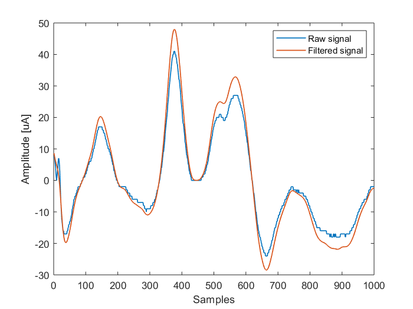
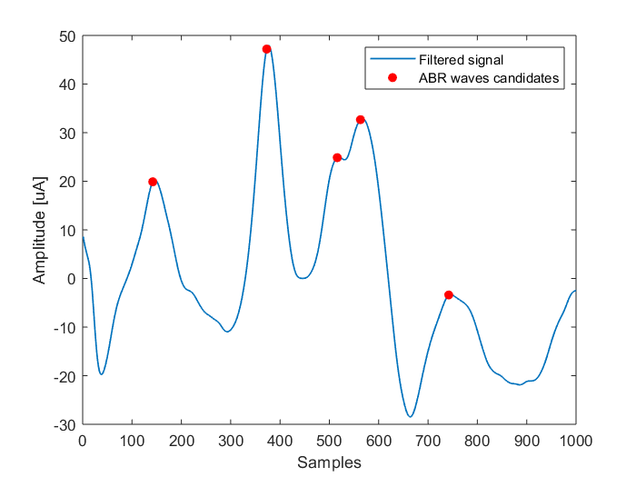
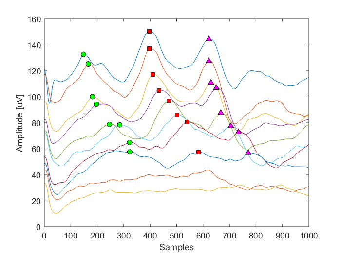

The auditory brainstem response (ABR) is an auditory evoked potential extracted from ongoing electrical activity in the brain and recorded via electrodes placed on the scalp. The measured recording is a series of six to seven vertex positive waves of which I through V are evaluated. 

Scheme of I, III and V waves detection algorithm is based on stationary wavelet decomposition (SWD) of signal preceded by bandpass filtering (in range 0.3-3 kHz).

Img 1: First step of algorithm - bandpass filtering

Img 2: Next step is local maxima detection based on SWD.  

There are two importatnt information:
1. I, III and V waves occur at least 1 ms after each other,
2. delay of I, III and V waves grows with decrease of stimulation intensity.

Img 3: Final results.  

ABR data:
http://www.physionet.org/pn6/earndb/
