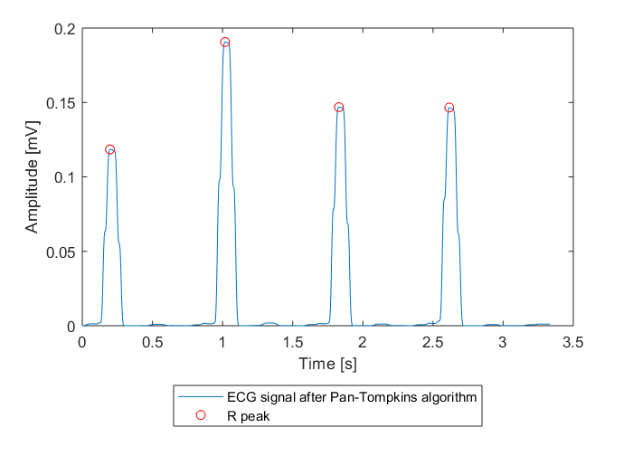
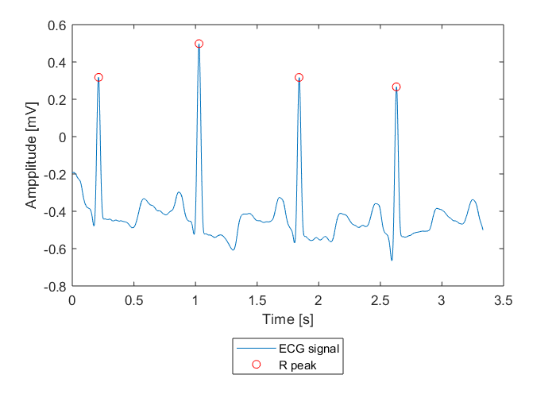
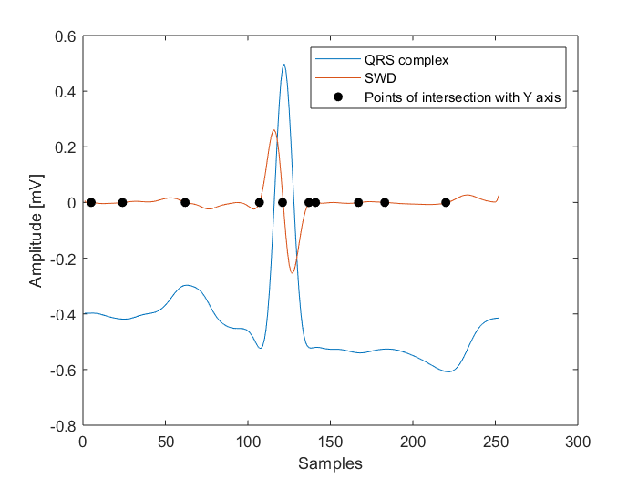
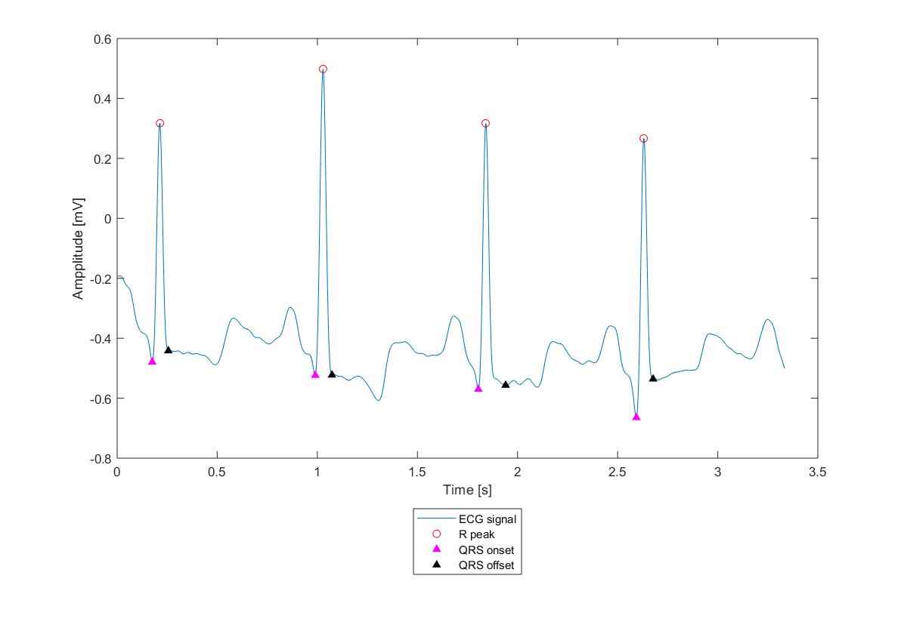

Classes aims to implement the R-peak and QRS on/offsets detection algorithm in the ECG signal. The Pan Tompkins algorithm has been implemented to R-peak detection.

Pan Tompkins algorithm consists following steps: 
1. Signal bandpass filtering. 
2. Signal differentiation. 
3. Signal powering.
4. Signal integration. 
5. R-peak selection. 

2-4 steps are aimed at removing the effect of low-frequency components such as P and T waves and amplification of samples representing QRS complexes. Integration of the signal in a moving window, without application, is aimed at obtaining a single wave from the QRS complex.

For R-peak selection stationary wavelet decomposition (SWD) based algorithm where used. 

Img 1: Pan Tompkins algorithm results

Img 2: Pan Tompkins algorithm results on ECG signal

For QRS on/offsets another SWD based algorithm where implemented. Characteristic points that can be selected from the points of intersection of the wavelet with the Y axis are three points located in the neighborhood of the R-wave, the preceding point and the following, points pointing to the Q and S waves. The R point is known from the previous step. The visual results of the algorithm below.

Img 3: SWD on QRS complex 

Img 4: Algorithm results

ECG database: http://www.physionet.org/physiobank/database/#ecg
